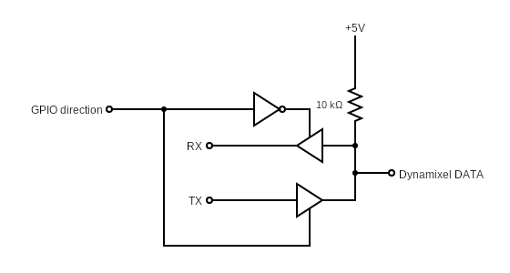

# RPI dynamixel AX-12a
Python library for Dynamixel AX12 servos with Raspberry Pi. It is also compatible with Jetson Nano.


## Requirements

This library uses [RPi.GPIO](https://pypi.org/project/RPi.GPIO/) for Raspberry pi and [Jetson.GPIO](https://github.com/NVIDIA/jetson-gpio) for Jetson Nano.

## Installation

In order to build library run:
```bash
python3 setup.py install
```

## DynamixelPort class and bus connection

`DynamixelPort` class implements handler for serial port used by given motor. Each motor need pin to switch direction on half duplex UART used to communicate with motor. The pin is switching direction of three state buffer. As buffer you can use SN74LS241N. The diagram below shows how it can be connected:

<div style="text-align:center">

</div>


## Motor class
### Setting/Reading memory cells directly
This library provides getters and setters for each memory cell. Accessing data stored in cells is done as follows:
```python
# setting single byte of EEPROM
motor.eeprom.temperature_limit.value = [80]

# getting single byte stored in EEPROM
motor.eeprom.temperature_limit.value
>>> [80] # Output

# setting two bytes of RAM
motor.ram.moving_speed.value = [0x01, 0x00]

# getting two bytes from RAM
motor.ram.moving_speed.value
>>> [1, 0] # Output
```

If you are setting two or more bytes first value in array will be the highest byte and last value will be the lowest byte.


### Functions
- `target_position(pos)` - set current target position. Input is *uint16* ranging from 0 to 1023. Command is executed after calling `action()` method.
- `target_velovity(vel)` - set current target velocity. Input is *uint16* ranging from 0 to 1023. Command is executed after calling `action()` method.
- `target_torque(torque)` - set current target torque. Input is *uint16* ranging from 0 to 1023. Command is executed after calling `action()` method.
- `position_speed_torque(pos, vel, tq)` - set current target position, velocity and torque. Inputs are *uint16* ranging from 0 to 1023. Command is executed after calling `action()` method.
- ``action()` - applies changes made in RAM and EEPROM memories. Does not have confirmation.
- `reboot()` - reboots motor.
- `factory_reset()` - factory reset of motor.
- `ping()` - ping motor. If ping succeeded `[]` *(empty array)* is returned.


### Getters
- `current_position_speed_torque` - current position, speed and torque of motor. Bytes are already combined to *uint16* values.

- `motor_status` - current voltage, temperature, registered flag status and moving flag status. Values are returned as array.

## Usage

Each motor has it's own `Motor` object. You can also define Motor at address `0xFE`. It's broadcast address. It can be used for example to factory reset motors or trigger actions globally.

### Set motor ID
By default motors have ID set to `0x01`. This example will set motor's ID to `0x02`.
``` python
from rpi_dynamixel_ax12a import DynamixelPort, Motor

port_handler = DynamixelPort(port_id='/dev/ttyAMA0', pin=18)
motor = Motor(port_handler, 0x01)

# setting id
motor.eeprom.id.value = [0x02]
motor.action()
```

### Three motors: position, velocity, torque control

``` python
from rpi_dynamixel_ax12a import DynamixelPort, Motor

port_handler = DynamixelPort(port_id='/dev/ttyAMA0', pin=18)
motors = [Motor(port_handler, 0x01),
          Motor(port_handler, 0x02),
          Motor(port_handler, 0x03),
          Motor(port_handler, 0xFE)]

# set positions
motors[0].position_speed_torque(0, 512, 512)
motors[1].position_speed_torque(0, 512, 512)
motors[2].position_speed_torque(0, 512, 512)
motors[-1].action()
```

### Communication errors
Communication errors are represented as `ValueError` exception. It might be changed in future.
Exceptions are raised when:
- No there was no response from motor.
- Incorrect motor responded to request (common issue when using multicast).
- Frame had incorrect header.
- Checksum mismatch ocurred.

Errors are just passed and not handled. It's in user responsibility to properly deal with error.